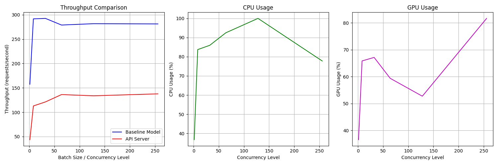
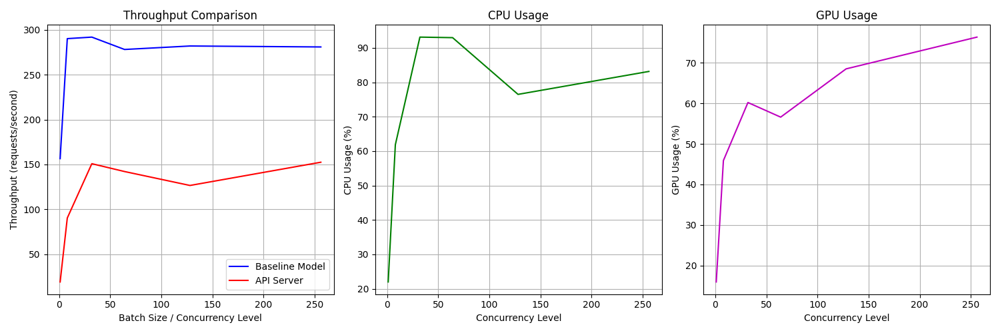
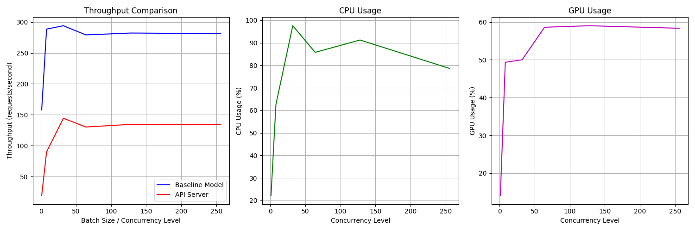

## Move this to readme.md

GPU: g4dn.xlarge 16 GB RAM T4 - cuda 12.4

### Experiment Explanation:

In this series of experiments, server and client configurations were optimized incrementally to improve throughput and reduce bottlenecks in deploying a Cat-Dog/Dog-Breed classifier with LitServe. 

**Experiment 1** served as a baseline with no batching or worker configurations, yielding suboptimal GPU and CPU utilization due to lack of concurrency. 

**Experiment 2** introduced batch processing, slightly improving throughput as the server began to handle requests more efficiently by aggregating them. 

**Experiment 3** Adding workers significantly boosted performance by parallelizing request processing, leveraging multi-core CPU resources. 

**Experiment 4** Transitioning to float16 precision further optimized GPU utilization and throughput by reducing computational overhead, though with some trade-offs in single-threaded performance. 

**Experiment 5** Tuning batch timeout 

**Experiment 6** max batch size refined batching behavior, leading to a balance between throughput and latency. Overall, the incremental optimizations showcased progressive utilization of hardware capabilities, with GPU and CPU reaching near-maximum efficiencies at higher concurrency levels and tuned configurations.

### Theoretical Maximum Throughput

The theoretical maximum throughput represents the upper bound of requests per second that a server can process under ideal conditions. It is determined by:

Hardware limitations (GPU computation capacity, CPU, memory bandwidth).
Precision (lower precision like float16 reduces computational load, allowing more inferences).
Concurrency and batching efficiency (more concurrent threads/workers leverage the hardware optimally).

*To calculate the theoretical maximum throughput:*

Estimate the time for a single inference at peak GPU usage (e.g., based on the maximum GPU utilization observed in the benchmarks).
Divide 1 by the inference time to get the per-second throughput.
Multiply by the batch size and the number of workers to factor in parallel processing.
For your experiments, **maximum GPU usage (82.7%) and batch size 256** **with float16** suggest near-optimal GPU utilization. The server may approach ~300 reqs/sec under perfect conditions, considering diminishing returns beyond these optimizations.

### Theoretical Calculation

- T4 GPU TFLOPS - Float 32 - 8.1

- T4 GPU TFLOPS - Float 16 - 65

Get FLOPs of your model - `python tests/test_flops.py`

**Float 32 - Thoeretical throughput**

- Custom Model FLOPS = 4.45×10^9 = 4.45 GB FLOPS

- T4 GPU = 8.1 * 10^12 = 8000.1 GFLOPS or 8.1 TFLOPS

- Theoretical time (in seconds)= GPU TFLOPs / (FLOPs of Model)
​​

- Theoretical time = 4.45 / 8000.1 = 0.000549 seconds = 549 micro seconds

*Thoeretical throughput*

- Thoeretical throughput (request/second) = (GPU TFLOPS * 10^12)/(MODEL FLOPS)

- Inference per second = 1/ 549 micro second = 1820 request per second

With 64 batchsize we were able to get only `160.85 reqs/sec` in api serving and we have not yet reached even near the practical baseline throughput model also

**Float 16**

- Custom Model FLOPS = 4.45×10^9 = 4.45 GB FLOPS
T4 GPU = 8.1 * 10^12 = 65000.1 GFLOPS or 65.1 TFLOPS

- Theoretical time (in seconds)= GPU TFLOPs / (FLOPs of Model)
​​
- Theoretical time = 4.45 / 65000.1 = 6.83×10^(-5) seconds

**Thoeretical throughput**

- Thoeretical throughput (request/second) = (GPU TFLOPS * 10^12)/(MODEL FLOPS)

- Inference per second = 1/ 6.83×10^(-5) = 14,640 request per second

With 256 batchsize we were able to get only `152.51 reqs/sec` in api serving and we have not yet reached even near the practical baseline throughput model also

**Reference**

- [Test Program](./tests/test_flops.py)

- [T4 GPU GFLOPS](https://www.dell.com/support/kbdoc/en-us/000132094/deep-learning-performance-on-t4-gpus-with-mlperf-benchmarks)


### Experiment 1

**Server**: server_baseline.py

*precision* : Full (float32) | *max_batch_size* : 4096 | *batch_timeout* : 0.01 | *workers* : 0

**Client**: tests/benchmark_base.py

**Client Hyper prameter Setting**

*batch_sizes* : [1, 8, 32, 64, 128, 256] | **benchmark_api.num_requests** : **128**

*Result plot*

```
Running baseline throughput tests...
Batch size 1: 181.62 reqs/sec
Batch size 8: 297.16 reqs/sec
Batch size 32: 295.98 reqs/sec
Batch size 64: 276.82 reqs/sec
Batch size 128: 280.78 reqs/sec
Batch size 256: 280.83 reqs/sec
Running API benchmarks...
Concurrency 1: 37.74 reqs/sec, CPU: 20.6%, GPU: 13.1%
Concurrency 8: 82.58 reqs/sec, CPU: 43.6%, GPU: 38.2%
Concurrency 32: 80.53 reqs/sec, CPU: 45.1%, GPU: 31.8%
Concurrency 64: 78.41 reqs/sec, CPU: 37.7%, GPU: 36.2%
Concurrency 128: 90.05 reqs/sec, CPU: 49.1%, GPU: 39.2%
Concurrency 256: 90.58 reqs/sec, CPU: 43.7%, GPU: 38.5%
```


**Hyper prameter Setting**

*batch_sizes* : [1, 8, 32, 64, 128, 256] | **benchmark_api.num_requests** : **256**


*Result plot*

```
Running baseline throughput tests...
Batch size 1: 181.18 reqs/sec
Batch size 8: 284.97 reqs/sec
Batch size 32: 293.08 reqs/sec
Batch size 64: 280.36 reqs/sec
Batch size 128: 283.41 reqs/sec
Batch size 256: 280.35 reqs/sec
Running API benchmarks...
Concurrency 1: 82.81 reqs/sec, CPU: 40.7%, GPU: 41.4%
Concurrency 8: 91.88 reqs/sec, CPU: 47.2%, GPU: 37.7%
Concurrency 32: 90.56 reqs/sec, CPU: 48.3%, GPU: 35.9%
Concurrency 64: 89.32 reqs/sec, CPU: 46.3%, GPU: 38.8%
Concurrency 128: 86.09 reqs/sec, CPU: 40.9%, GPU: 39.8%
Concurrency 256: 85.84 reqs/sec, CPU: 38.5%, GPU: 40.2%
```


### Experiment 2

Going with *benchmark_api.num_requests*=256 as it gives good utilization

**Server**: server_batch_fullp_w0.py

**Batch processing**

*precision* : Full (float32) | *max_batch_size* : 4096 | *batch_timeout* : 0.01 | *workers* : 0


**Client**: tests/benchmark_base.py

**Client Hyper prameter Setting**

*batch_sizes* : [1, 8, 32, 64, 128, 256] | *benchmark_api.num_requests* : 256

```
Running baseline throughput tests...
Batch size 1: 183.52 reqs/sec
Batch size 8: 289.45 reqs/sec
Batch size 32: 292.08 reqs/sec
Batch size 64: 276.93 reqs/sec
Batch size 128: 280.14 reqs/sec
Batch size 256: 280.34 reqs/sec
\nRunning API benchmarks...
Concurrency 1: 46.17 reqs/sec, CPU: 24.9%, GPU: 18.9%
Concurrency 8: 100.87 reqs/sec, CPU: 40.5%, GPU: 25.5%
Concurrency 32: 114.23 reqs/sec, CPU: 44.6%, GPU: 35.9%
Concurrency 64: 111.32 reqs/sec, CPU: 49.0%, GPU: 36.3%
Concurrency 128: 117.67 reqs/sec, CPU: 42.4%, GPU: 53.0%
Concurrency 256: 124.09 reqs/sec, CPU: 39.3%, GPU: 40.4%
```


### Experiment 3

**Server**: server_batch_fullp.py

*precision* : Full (float32) | *max_batch_size* : 4096 | *batch_timeout* : 0.01  | **workers** : **4**

 workers 4

**Client**: tests/benchmark_base.py

**Client Hyper prameter Setting**

*batch_sizes* : [1, 8, 32, 64, 128, 256] | *benchmark_api.num_requests* : 256


```
Running baseline throughput tests...
Batch size 1: 161.91 reqs/sec
Batch size 8: 291.14 reqs/sec
Batch size 32: 292.65 reqs/sec
Batch size 64: 278.49 reqs/sec
Batch size 128: 281.33 reqs/sec
Batch size 256: 280.38 reqs/sec
Running API benchmarks...
Concurrency 1: 41.32 reqs/sec, CPU: 36.9%, GPU: 20.4%
Concurrency 8: 132.28 reqs/sec, CPU: 93.0%, GPU: 49.8%
Concurrency 32: 148.67 reqs/sec, CPU: 99.5%, GPU: 42.4%
Concurrency 64: 160.85 reqs/sec, CPU: 99.5%, GPU: 60.2%
Concurrency 128: 131.51 reqs/sec, CPU: 82.2%, GPU: 50.8%
Concurrency 256: 130.53 reqs/sec, CPU: 71.3%, GPU: 82.7%
```


### Experiment 4

**Server**: server_batch_halfp.py

**precision** : **Half (float16)** | *max_batch_size* : 4096 | *batch_timeout* : 0.01 | *workers* : 4

**Client**: tests/benchmark_base.py

**Client Hyper prameter Setting**

*batch_sizes* : [1, 8, 32, 64, 128, 256] | *benchmark_api.num_requests* : 256


```
Running baseline throughput tests...
Batch size 1: 157.38 reqs/sec
Batch size 8: 291.67 reqs/sec
Batch size 32: 292.66 reqs/sec
Batch size 64: 279.02 reqs/sec
Batch size 128: 281.80 reqs/sec
Batch size 256: 281.31 reqs/sec
\nRunning API benchmarks...
Concurrency 1: 43.53 reqs/sec, CPU: 36.7%, GPU: 36.6%
Concurrency 8: 112.87 reqs/sec, CPU: 83.7%, GPU: 65.9%
Concurrency 32: 121.17 reqs/sec, CPU: 86.0%, GPU: 67.2%
Concurrency 64: 136.24 reqs/sec, CPU: 92.5%, GPU: 59.4%
Concurrency 128: 133.77 reqs/sec, CPU: 100.0%, GPU: 52.8%
Concurrency 256: 137.70 reqs/sec, CPU: 77.8%, GPU: 81.7%
```




### Experiment 5

**Server**: server_batch_halfp.py

*precision* : Half (float16) | *max_batch_size* : 4096 | **batch_timeout** : **0.05** | *workers* : 4

**Client**: tests/benchmark_base.py

**Client Hyper prameter Setting**

*batch_sizes* : [1, 8, 32, 64, 128, 256] | *benchmark_api.num_requests* : 256


```
Running baseline throughput tests...
Batch size 1: 156.51 reqs/sec
Batch size 8: 290.05 reqs/sec
Batch size 32: 291.75 reqs/sec
Batch size 64: 277.99 reqs/sec
Batch size 128: 281.86 reqs/sec
Batch size 256: 280.80 reqs/sec
\nRunning API benchmarks...
Concurrency 1: 19.28 reqs/sec, CPU: 22.0%, GPU: 16.0%
Concurrency 8: 90.43 reqs/sec, CPU: 61.9%, GPU: 45.9%
Concurrency 32: 150.88 reqs/sec, CPU: 93.1%, GPU: 60.2%
Concurrency 64: 142.15 reqs/sec, CPU: 93.0%, GPU: 56.6%
Concurrency 128: 126.65 reqs/sec, CPU: 76.5%, GPU: 68.5%
Concurrency 256: 152.51 reqs/sec, CPU: 83.2%, GPU: 76.3%
```



### Experiment 6:

**Server**: server_batch_halfp.py

*precision* : Half (float16) | **max_batch_size** : **256** | *batch_timeout* : 0.05 | *workers* : 4

**Client**: tests/benchmark_base.py

**Client Hyper prameter Setting**

*batch_sizes* : [1, 8, 32, 64, 128, 256] | *benchmark_api.num_requests* : 256


```
Running baseline throughput tests...
Batch size 1: 157.74 reqs/sec
Batch size 8: 288.52 reqs/sec
Batch size 32: 293.95 reqs/sec
Batch size 64: 279.16 reqs/sec
Batch size 128: 282.15 reqs/sec
Batch size 256: 281.18 reqs/sec
\nRunning API benchmarks...
Concurrency 1: 19.29 reqs/sec, CPU: 22.2%, GPU: 14.1%
Concurrency 8: 90.11 reqs/sec, CPU: 62.6%, GPU: 49.3%
Concurrency 32: 144.32 reqs/sec, CPU: 97.6%, GPU: 50.0%
Concurrency 64: 130.22 reqs/sec, CPU: 85.8%, GPU: 58.6%
Concurrency 128: 134.48 reqs/sec, CPU: 91.2%, GPU: 59.0%
Concurrency 256: 134.46 reqs/sec, CPU: 78.6%, GPU: 58.3%
```


