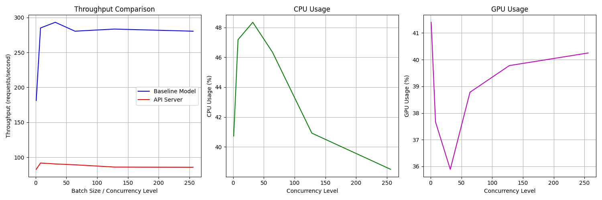
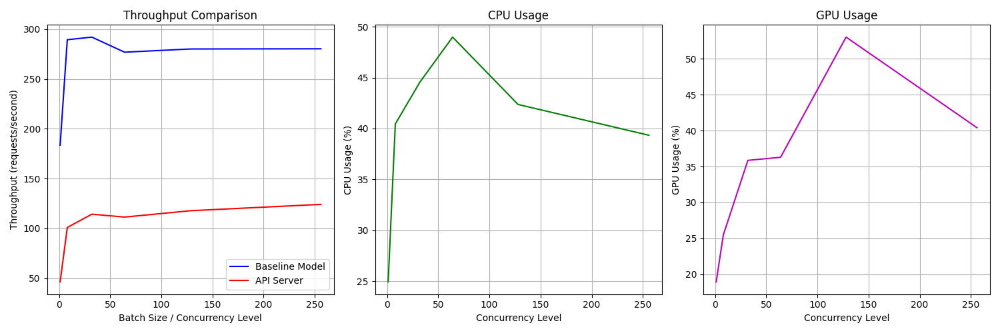
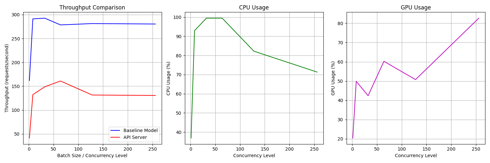
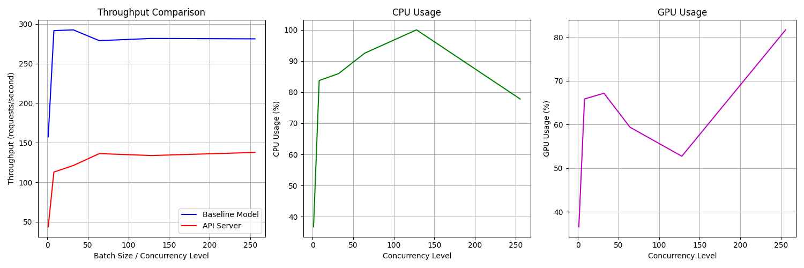
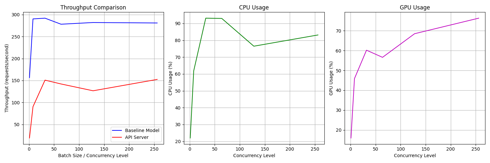
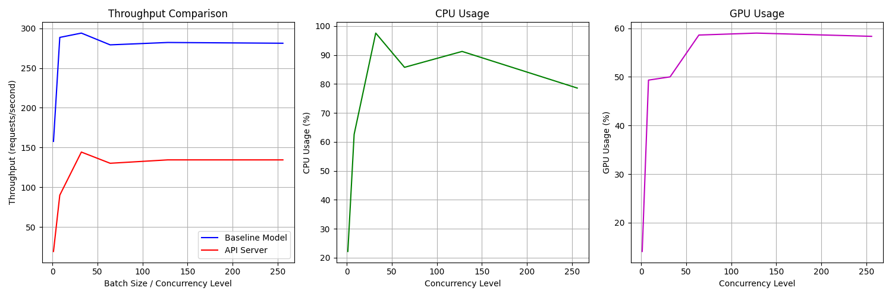

# s09-emlov4-litserve - Deployment Using LitServe

This assignment was completed using Torch-AO for optimization, incorporating techniques such as 4-bit quantization, attention mechanisms, static caching, and max-autotune. Additionally, a separate experiment was conducted using PEFT, LoRA, and advanced attention techniques for 4-bit optimization. The Torch-AO approach demonstrated a 56% performance improvement over the PEFT-LoRA optimization method.

### Requirements

- Deploy the Cat-Dog or Dog-Breed Classifier with LitServe and benchmark the server performance.
    - Find bottlenecks and optimize incrementally
    - Document everything in your README with plots for comparison with Theoretical maximum throughput
    - Any instance with GPU

- Deploy any llama based llm
    - Benchmark tokens/sec and compare with theoretical max
    - No Batching
    - BONUS: Use TorchAO to further push the model: https://huggingface.co/docs/transformers/main/en/quantization/torchao
    - BONUS: You can use further more optimizations for LLMs from here: https://huggingface.co/docs/transformers/main/en/llm_optims

### Development Command and Debug Commands

**Docker commands**

```
# Build image
docker build -t cat_dog_image .

# Create container with gpu option
docker run -d --gpus=all -v /home/ubuntu/dev/s09-emlov4-litserve:/workspace  cat_dog_image

# Use interactive prompt to container for development and debugging
docker exec -it <container_id>   /bin/bash 
```

**Push AMI to AWS Private AMI location**

```
# Configure with your accesskey and secret
aws configure

# From you own instance where you are fetches the instance-id and pushes the AMI to private ami location
aws ec2 create-image \
    --instance-id $(curl -s http://169.254.169.254/latest/meta-data/instance-id) \
    --name "s09-ami-1" \
    --description "AMI created programmatically from this instance" \
    --no-reboot

# You would get a ami-id like this ami-0ad5900ef6b0bcaf4
```

#### Build Command

**GPU Usage**

- Pass cuda parameter to trainer so that it trains with GPU
- You need to pass `--gpus=all` to docker run command so that it uses host GPU

**Debug Commands for development**


**Install**

```export UV_EXTRA_INDEX_URL: https://download.pytorch.org/whl/cpu```

OR 

```uv sync --extra-index-url https://download.pytorch.org/whl/cpu ```

if you are going by `--extra-index-url` method you might need to give it every time when u use `uv` command

### Task-1-LitServe-Cat-Dog-dataset

**EC2 - GPU Config**: g4dn.xlarge 16 GB RAM T4 - cuda 12.4

**Server**

```python src/server_baseline.py```

**Client**

```python tests/benchmark_base.py```

### Experiment Explanation:

In this series of experiments, server and client configurations were optimized incrementally to improve throughput and reduce bottlenecks in deploying a Cat-Dog/Dog-Breed classifier with LitServe. 

**Experiment 1** served as a baseline with no batching or worker configurations, yielding suboptimal GPU and CPU utilization due to lack of concurrency. 

**Experiment 2** introduced batch processing, slightly improving throughput as the server began to handle requests more efficiently by aggregating them. 

**Experiment 3** Adding workers significantly boosted performance by parallelizing request processing, leveraging multi-core CPU resources. 

**Experiment 4** Transitioning to float16 precision further optimized GPU utilization and throughput by reducing computational overhead, though with some trade-offs in single-threaded performance. 

**Experiment 5** Tuning batch timeout 

**Experiment 6** max batch size refined batching behavior, leading to a balance between throughput and latency. Overall, the incremental optimizations showcased progressive utilization of hardware capabilities, with GPU and CPU reaching near-maximum efficiencies at higher concurrency levels and tuned configurations.

### Theoretical Maximum Throughput

The theoretical maximum throughput represents the upper bound of requests per second that a server can process under ideal conditions. It is determined by:

Hardware limitations (GPU computation capacity, CPU, memory bandwidth).
Precision (lower precision like float16 reduces computational load, allowing more inferences).
Concurrency and batching efficiency (more concurrent threads/workers leverage the hardware optimally).

*To calculate the theoretical maximum throughput:*

Estimate the time for a single inference at peak GPU usage (e.g., based on the maximum GPU utilization observed in the benchmarks).
Divide 1 by the inference time to get the per-second throughput.
Multiply by the batch size and the number of workers to factor in parallel processing.
For your experiments, **maximum GPU usage (82.7%) and batch size 256** **with float16** suggest near-optimal GPU utilization. The server may approach ~300 reqs/sec under perfect conditions, considering diminishing returns beyond these optimizations.

### Theoretical Calculation

- T4 GPU TFLOPS - Float 32 - 8.1

- T4 GPU TFLOPS - Float 16 - 65

Get FLOPs of your model - `python tests/test_flops.py`

**Float 32 - Thoeretical throughput**

- Custom Model FLOPS = 4.45×10^9 = 4.45 GB FLOPS

- T4 GPU = 8.1 * 10^12 = 8000.1 GFLOPS or 8.1 TFLOPS

- Theoretical time (in seconds)= GPU TFLOPs / (FLOPs of Model)
​​

- Theoretical time = 4.45 / 8000.1 = 0.000549 seconds = 549 micro seconds

*Thoeretical throughput*

- Thoeretical throughput (request/second) = (GPU TFLOPS * 10^12)/(MODEL FLOPS)

- Inference per second = 1/ 549 micro second = 1820 request per second

With 64 batchsize we were able to get only `160.85 reqs/sec` in api serving and we have not yet reached even near the practical baseline throughput model also

**Float 16**

- Custom Model FLOPS = 4.45×10^9 = 4.45 GB FLOPS
T4 GPU = 8.1 * 10^12 = 65000.1 GFLOPS or 65.1 TFLOPS

- Theoretical time (in seconds)= GPU TFLOPs / (FLOPs of Model)
​​
- Theoretical time = 4.45 / 65000.1 = 6.83×10^(-5) seconds

**Thoeretical throughput**

- Thoeretical throughput (request/second) = (GPU TFLOPS * 10^12)/(MODEL FLOPS)

- Inference per second = 1/ 6.83×10^(-5) = 14,640 request per second

With 256 batchsize we were able to get only `152.51 reqs/sec` in api serving and we have not yet reached even near the practical baseline throughput model also

**Reference**

- [Test Program](./tests/test_flops.py)

- [T4 GPU GFLOPS](https://www.dell.com/support/kbdoc/en-us/000132094/deep-learning-performance-on-t4-gpus-with-mlperf-benchmarks)


### Task-1-Experiment 1

**Server**: server_baseline.py

*precision* : Full (float32) | *max_batch_size* : 4096 | *batch_timeout* : 0.01 | *workers* : 0

**Client**: tests/benchmark_base.py

**Client Hyper prameter Setting**

*batch_sizes* : [1, 8, 32, 64, 128, 256] | **benchmark_api.num_requests** : **128**

*Result plot*

```
Running baseline throughput tests...
Batch size 1: 181.62 reqs/sec
Batch size 8: 297.16 reqs/sec
Batch size 32: 295.98 reqs/sec
Batch size 64: 276.82 reqs/sec
Batch size 128: 280.78 reqs/sec
Batch size 256: 280.83 reqs/sec
Running API benchmarks...
Concurrency 1: 37.74 reqs/sec, CPU: 20.6%, GPU: 13.1%
Concurrency 8: 82.58 reqs/sec, CPU: 43.6%, GPU: 38.2%
Concurrency 32: 80.53 reqs/sec, CPU: 45.1%, GPU: 31.8%
Concurrency 64: 78.41 reqs/sec, CPU: 37.7%, GPU: 36.2%
Concurrency 128: 90.05 reqs/sec, CPU: 49.1%, GPU: 39.2%
Concurrency 256: 90.58 reqs/sec, CPU: 43.7%, GPU: 38.5%
```


**Hyper prameter Setting**

*batch_sizes* : [1, 8, 32, 64, 128, 256] | **benchmark_api.num_requests** : **256**


*Result plot*

```
Running baseline throughput tests...
Batch size 1: 181.18 reqs/sec
Batch size 8: 284.97 reqs/sec
Batch size 32: 293.08 reqs/sec
Batch size 64: 280.36 reqs/sec
Batch size 128: 283.41 reqs/sec
Batch size 256: 280.35 reqs/sec
Running API benchmarks...
Concurrency 1: 82.81 reqs/sec, CPU: 40.7%, GPU: 41.4%
Concurrency 8: 91.88 reqs/sec, CPU: 47.2%, GPU: 37.7%
Concurrency 32: 90.56 reqs/sec, CPU: 48.3%, GPU: 35.9%
Concurrency 64: 89.32 reqs/sec, CPU: 46.3%, GPU: 38.8%
Concurrency 128: 86.09 reqs/sec, CPU: 40.9%, GPU: 39.8%
Concurrency 256: 85.84 reqs/sec, CPU: 38.5%, GPU: 40.2%
```



### Task-1-Experiment 2

Going with *benchmark_api.num_requests*=256 as it gives good utilization

**Server**: server_batch_fullp_w0.py

**Batch processing**

*precision* : Full (float32) | *max_batch_size* : 4096 | *batch_timeout* : 0.01 | *workers* : 0


**Client**: tests/benchmark_base.py

**Client Hyper prameter Setting**

*batch_sizes* : [1, 8, 32, 64, 128, 256] | *benchmark_api.num_requests* : 256

```
Running baseline throughput tests...
Batch size 1: 183.52 reqs/sec
Batch size 8: 289.45 reqs/sec
Batch size 32: 292.08 reqs/sec
Batch size 64: 276.93 reqs/sec
Batch size 128: 280.14 reqs/sec
Batch size 256: 280.34 reqs/sec
\nRunning API benchmarks...
Concurrency 1: 46.17 reqs/sec, CPU: 24.9%, GPU: 18.9%
Concurrency 8: 100.87 reqs/sec, CPU: 40.5%, GPU: 25.5%
Concurrency 32: 114.23 reqs/sec, CPU: 44.6%, GPU: 35.9%
Concurrency 64: 111.32 reqs/sec, CPU: 49.0%, GPU: 36.3%
Concurrency 128: 117.67 reqs/sec, CPU: 42.4%, GPU: 53.0%
Concurrency 256: 124.09 reqs/sec, CPU: 39.3%, GPU: 40.4%
```




### Task-1-Experiment 3

**Server**: server_batch_fullp.py

*precision* : Full (float32) | *max_batch_size* : 4096 | *batch_timeout* : 0.01  | **workers** : **4**

 workers 4

**Client**: tests/benchmark_base.py

**Client Hyper prameter Setting**

*batch_sizes* : [1, 8, 32, 64, 128, 256] | *benchmark_api.num_requests* : 256


```
Running baseline throughput tests...
Batch size 1: 161.91 reqs/sec
Batch size 8: 291.14 reqs/sec
Batch size 32: 292.65 reqs/sec
Batch size 64: 278.49 reqs/sec
Batch size 128: 281.33 reqs/sec
Batch size 256: 280.38 reqs/sec
Running API benchmarks...
Concurrency 1: 41.32 reqs/sec, CPU: 36.9%, GPU: 20.4%
Concurrency 8: 132.28 reqs/sec, CPU: 93.0%, GPU: 49.8%
Concurrency 32: 148.67 reqs/sec, CPU: 99.5%, GPU: 42.4%
Concurrency 64: 160.85 reqs/sec, CPU: 99.5%, GPU: 60.2%
Concurrency 128: 131.51 reqs/sec, CPU: 82.2%, GPU: 50.8%
Concurrency 256: 130.53 reqs/sec, CPU: 71.3%, GPU: 82.7%
```



### Task-1-Experiment 4

**Server**: server_batch_halfp.py

**precision** : **Half (float16)** | *max_batch_size* : 4096 | *batch_timeout* : 0.01 | *workers* : 4

**Client**: tests/benchmark_base.py

**Client Hyper prameter Setting**

*batch_sizes* : [1, 8, 32, 64, 128, 256] | *benchmark_api.num_requests* : 256


```
Running baseline throughput tests...
Batch size 1: 157.38 reqs/sec
Batch size 8: 291.67 reqs/sec
Batch size 32: 292.66 reqs/sec
Batch size 64: 279.02 reqs/sec
Batch size 128: 281.80 reqs/sec
Batch size 256: 281.31 reqs/sec

Running API benchmarks...
Concurrency 1: 43.53 reqs/sec, CPU: 36.7%, GPU: 36.6%
Concurrency 8: 112.87 reqs/sec, CPU: 83.7%, GPU: 65.9%
Concurrency 32: 121.17 reqs/sec, CPU: 86.0%, GPU: 67.2%
Concurrency 64: 136.24 reqs/sec, CPU: 92.5%, GPU: 59.4%
Concurrency 128: 133.77 reqs/sec, CPU: 100.0%, GPU: 52.8%
Concurrency 256: 137.70 reqs/sec, CPU: 77.8%, GPU: 81.7%
```




### Task-1-Experiment 5

**Server**: server_batch_halfp.py

*precision* : Half (float16) | *max_batch_size* : 4096 | **batch_timeout** : **0.05** | *workers* : 4

**Client**: tests/benchmark_base.py

**Client Hyper prameter Setting**

*batch_sizes* : [1, 8, 32, 64, 128, 256] | *benchmark_api.num_requests* : 256


```
Running baseline throughput tests...
Batch size 1: 156.51 reqs/sec
Batch size 8: 290.05 reqs/sec
Batch size 32: 291.75 reqs/sec
Batch size 64: 277.99 reqs/sec
Batch size 128: 281.86 reqs/sec
Batch size 256: 280.80 reqs/sec
\nRunning API benchmarks...
Concurrency 1: 19.28 reqs/sec, CPU: 22.0%, GPU: 16.0%
Concurrency 8: 90.43 reqs/sec, CPU: 61.9%, GPU: 45.9%
Concurrency 32: 150.88 reqs/sec, CPU: 93.1%, GPU: 60.2%
Concurrency 64: 142.15 reqs/sec, CPU: 93.0%, GPU: 56.6%
Concurrency 128: 126.65 reqs/sec, CPU: 76.5%, GPU: 68.5%
Concurrency 256: 152.51 reqs/sec, CPU: 83.2%, GPU: 76.3%
```



### Task-1-Experiment 6:

**Server**: server_batch_halfp.py

*precision* : Half (float16) | **max_batch_size** : **256** | *batch_timeout* : 0.05 | *workers* : 4

**Client**: tests/benchmark_base.py

**Client Hyper prameter Setting**

*batch_sizes* : [1, 8, 32, 64, 128, 256] | *benchmark_api.num_requests* : 256


```
Running baseline throughput tests...
Batch size 1: 157.74 reqs/sec
Batch size 8: 288.52 reqs/sec
Batch size 32: 293.95 reqs/sec
Batch size 64: 279.16 reqs/sec
Batch size 128: 282.15 reqs/sec
Batch size 256: 281.18 reqs/sec
\nRunning API benchmarks...
Concurrency 1: 19.29 reqs/sec, CPU: 22.2%, GPU: 14.1%
Concurrency 8: 90.11 reqs/sec, CPU: 62.6%, GPU: 49.3%
Concurrency 32: 144.32 reqs/sec, CPU: 97.6%, GPU: 50.0%
Concurrency 64: 130.22 reqs/sec, CPU: 85.8%, GPU: 58.6%
Concurrency 128: 134.48 reqs/sec, CPU: 91.2%, GPU: 59.0%
Concurrency 256: 134.46 reqs/sec, CPU: 78.6%, GPU: 58.3%
```




### Task-2 Deploy any llama based llm with LitServe

**Basic LLM Working of Llama 8B and 1B Instruct models**

- ```python src/sample_test_working.py```

- ```python src/sample_test_llama32_working.py```

**Usage**

### Task-2-Experiment 1

**Model** : `unsloth/Llama-3.2-1B-Instruct`

**Optimization** : PERF + LORA - 4-bit quantization

**Server**

- ```python src/server_llm_llama3_2.py```

**Client**

- ```python tests/test_llm_llama_3_2.py```

```
Benchmakring for unsloth/Llama-3.2-1B-Instruct with max_tokens 250
Run no 0 - model_throughput(tokens/sec) - 15.91032594111205 | theoretical_max - 150 
Run no 1 - model_throughput(tokens/sec) - 15.918434793146428 | theoretical_max - 150 
Run no 2 - model_throughput(tokens/sec) - 15.946354350946034 | theoretical_max - 150 
Run no 3 - model_throughput(tokens/sec) - 15.904872901654354 | theoretical_max - 150 
Run no 4 - model_throughput(tokens/sec) - 15.948213135458118 | theoretical_max - 150 
```

### Task-2-Experiment 2

**Model** : `unsloth/Llama-3.2-1B-Instruct`

**Optimization** : PERF + LORA - 4-bit quantization

**Server**

- ```python src/server_llm_llama3_2.py```

**Client**

- ```python tests/test_llm_llama_3_2.py```

```
Benchmakring for unsloth/Llama-3.2-1B-Instruct with max_tokens 500
Run no 0 - model_throughput(tokens/sec) - 15.875130450471548 | theoretical_max - 150 
Run no 1 - model_throughput(tokens/sec) - 15.891949508097365 | theoretical_max - 150 
Run no 2 - model_throughput(tokens/sec) - 15.87916840600827 | theoretical_max - 150 
Run no 3 - model_throughput(tokens/sec) - 15.884255381263513 | theoretical_max - 150 
Run no 4 - model_throughput(tokens/sec) - 15.89836775118845 | theoretical_max - 150
```

### Task-2-Experiment 3

**Model** : `unsloth/Llama-3.2-1B-Instruct-bnb-4bit`

**Optimization** : torch-ao 4 bit quantatization, attention, static cache, max-autotune

**Server**

- ```python src/server_llm_llama3_2_torchao.py```

**Client**

- ```python tests/test_llm_llama_3_2.py```

- change the model name while running but how ever `server_llm_llama3_2_torchao.py` is hardcoded with correct model name for torchao 4-bit model

```
Benchmakring for unsloth/Llama-3.2-1B-Instruct-bnb-4bit with max_tokens 250
Run no 0 - model_throughput(tokens/sec) - 16.645872485326894 | theoretical_max - 150 
Run no 1 - model_throughput(tokens/sec) - 24.916799895716238 | theoretical_max - 150 
Run no 2 - model_throughput(tokens/sec) - 24.889223601626053 | theoretical_max - 150 
Run no 3 - model_throughput(tokens/sec) - 24.810227143607555 | theoretical_max - 150 
Run no 4 - model_throughput(tokens/sec) - 24.63610144578302 | theoretical_max - 150 
```

### Task-2-Experiment 4

**Model** : `unsloth/Llama-3.2-1B-Instruct-bnb-4bit`

**Optimization** : torch-ao 4 bit quantatization, attention, static cache, max-autotune

**Server**

- ```python src/server_llm_llama3_2_torchao.py```

**Client**

- ```python tests/test_llm_llama_3_2.py```

- change the model name while running but how ever `server_llm_llama3_2_torchao.py` is hardcoded with correct model name for torchao 4-bit model

```
Benchmakring for unsloth/Llama-3.2-1B-Instruct-bnb-4bit with max_tokens 500
Run no 0 - model_throughput(tokens/sec) - 24.369102739963743 | theoretical_max - 150 
Run no 1 - model_throughput(tokens/sec) - 24.559441143452542 | theoretical_max - 150 
Run no 2 - model_throughput(tokens/sec) - 24.798074006805344 | theoretical_max - 150 
Run no 3 - model_throughput(tokens/sec) - 24.701174057950034 | theoretical_max - 150 
Run no 4 - model_throughput(tokens/sec) - 24.473459727389834 | theoretical_max - 150 
```

We can observe that after doing quantatization, attention, static cache, max-autotune we are able to get 24 tokens per second which is **56.98 %** increase.

### Theoretical Throughput calculation for LLama-1B model

*Config - g4dn.xlarge - T4 16 GB ram - accelerator memory bandwidth = 300 GB/s*

- time/token = total number of bytes moved (the model weights) / accelerator memory bandwidth
- time/token = (2 * 1B) bytes / (300 GB/s) = 6.67 ms/token
- Tokens/Second = 150 tokens/second

- Reference
    - [LLM transformer inference-guide](https://www.baseten.co/blog/llm-transformer-inference-guide/)

### Task-2 Bonus part of assignment

#### Torch-AO

- **torch-ao** is used for doing **4-bit quantatization**, eager mode attention as high end GPU is needed for flash-attention-2, static cache, max-autotune for 

#### Static Cache Implementation
- Sets `model.generation_config.cache_implementation = "static"` for optimized token caching during generation, reducing redundant computation and improving inference speed.

#### 4-bit Quantization
- Utilizes `BitsAndBytesConfig` for efficient model compression, enabling lower memory usage without significant loss of performance.

#### LoRA Configuration

**Key Parameters**:
- r=16: Defines the rank for low-rank updates, balancing performance and efficiency.
- lora_alpha=32: Scaling factor for LoRA updates.
- lora_dropout=0.05: Introduces slight regularization to prevent overfitting.
- bias="none": Excludes bias terms from updates for simplicity.
- task_type="CAUSAL_LM": Configures LoRA for causal language modeling tasks.
- target_modules: Specifies layers to apply LoRA.
Benefits:
- Memory Efficiency: 4-bit quantization and LoRA reduce model size while maintaining accuracy.
- Speed Optimization: Static caching accelerates inference by reusing cached tokens.
- Scalability: LoRA enables efficient fine-tuning for specific tasks without retraining the entire model.

```
peft_config = LoraConfig(
        r=16,
        lora_alpha=32,
        lora_dropout=0.05,
        bias="none",
        task_type="CAUSAL_LM",
        target_modules=self.modules
    )
```

### Take Aways
- Deploying in LitServe and how batch processing, num_workers and other parameters affect the throughput(requests per second) and GPU utilization efficiency.

- Find proper prompt and proper model for a llm task. Eg: We need to chose `Llama-3.2-1B-Instruct` instead of `Llama-3.2-1B` which is a base model that was not fine tuned for chat completion.

- We need to refer github codes or proper documentation for prompting or chat template specifically for a model `Llama-3.2-1B-Instruct`. Otherwise, we would be getting irrelvant junk values

- Use 4 bit models like `Llama-3.2-1B-Instruct-bnb-4bit` while doing torchao - 4 bit quantatization to avoid errors

### Results

- Deploy the Cat-Dog or Dog-Breed Classifier with LitServe and benchmark the server performance.
    - Screenshots and benchmark info attached above in Section 1 

- Deploy any llama based llm with LitServe
    - Theoretical max throughput = 150 tokens per second 
    - In this repo normal PEFT-LORA 4 bit with eager attention - 15.87 tokens per second
    - TorchAO 4 bit - We can observe that after doing quantatization, attention, static cache, max-autotune we are able to get 24 tokens per second which is **56.98 %** increase from PEFT-LORA technique.

Note: For llm - litserve task streaming method is not used, and a general non-streaming method is used.
