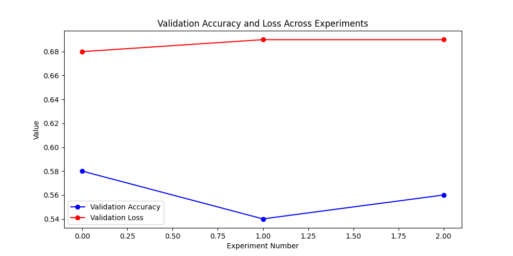

### Hyperparameters and test accuracy

|   Exp No |   epoch |   train_acc_epoch |   val_acc |   test_acc |   val_loss |   test_loss | base_model    |   patch_size |   embed_dim |
|---------:|--------:|------------------:|----------:|-----------:|-----------:|------------:|:--------------|-------------:|------------:|
|        0 |       2 |          0.585938 |  0.564732 |   0.597098 |   0.679125 |    0.676568 | convnext_tiny |            8 |          32 |
|        1 |       2 |          0.543403 |  0.570312 |   0.577009 |   0.678275 |    0.683202 | convnext_tiny |            8 |          48 |
|        2 |       2 |          0.559028 |  0.544643 |   0.544643 |   0.68714  |    0.68714  | convnext_tiny |            8 |          16 |

### Validation loss and validation accuracy plot

### Optuna Hyperparameter Optimization 
#### Experiment Name:  **catdog_classification** 
#### Best Parameters: 
- **model.patch_size**: 8
- **model.embed_dim**: 32

## Best Value (Metric):
**0.5971**
